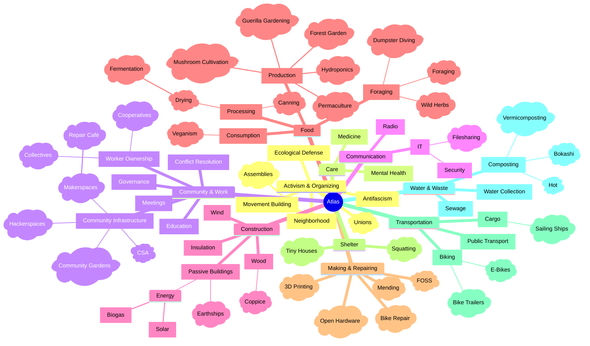

The page structure might end up looking something like this. 
The text should consist of clickable links.

```mermaid
mindmap
Solarpunk Knowledge Repository((Atlas))
	Activism & Organizing
		[Antifascism]
		[Ecological Defense]
		[Movement Building]
		[Neighborhood]
		  )Assemblies(
		)Unions(
	Care
		[Medicine]
		[Mental Health]
	Community & Work
	  [Community Infrastructure]
	    )Community Gardens(
	    )CSA(
	    )Makerspaces(
	      )Repair Café(
	    )Hackerspaces(
	  [Conflict Resolution]
	  [Education]
	  [Governance]
	  [Meetings]
	  [Worker Ownership]
	    )Collectives(
	    )Cooperatives(
	Communication
	  [IT]
	    )Filesharing(
	    [Security]
	  [Radio]
	Construction
	  [Insulation]
	  [Passive Buildings]
	    )Earthships(
    Energy
      [Biogas]
      [Solar]
	  [Wind]
	  [Wood]
	    )Coppice(
	Food
      [Production]
        )Forest Garden(
        )Guerilla Gardening(
        )Hydroponics(
        )Mushroom Cultivation(
        )Permaculture(
	  [Consumption]
        )Veganism(
	  [Foraging]
        )Dumpster Diving(
        )Foraging(
        )Wild Herbs(
	  [Processing]
	    )Canning(
	    )Drying(
        )Fermentation(
	Making & Repairing
	  )3D Printing(
	  )Bike Repair(
	  )Mending(
	  )Open Hardware(
	  )FOSS(
	Shelter
	  )Tiny Houses(
	  )Squatting(
	Transportation
	  [Biking]
		  )E-Bikes(
		  )Bike Trailers(
	  [Cargo]
	    )Sailing Ships(
	  [Public Transport]
	Water & Waste
	  [Sewage]
	  [Water Collection]
	  [Composting]
	    )Bokashi(
	    )Hot(
	    )Vermicomposting(
```
